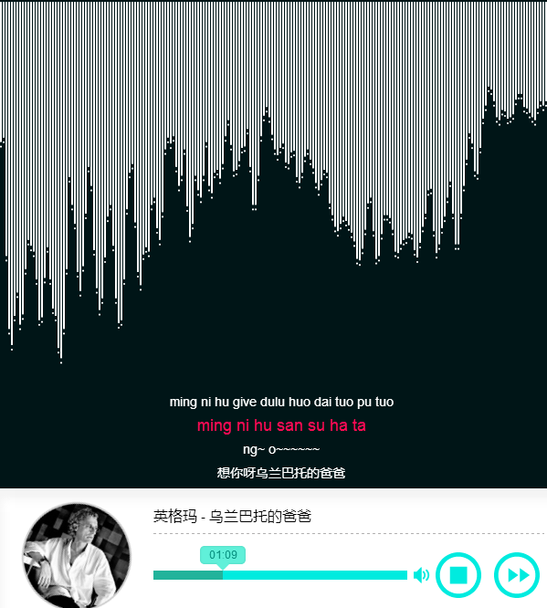

<h1>HTML5-FMPlayer</h1>

	学习 Web Audio Api 
	音乐为本地文件，网络寻找了好久没有音乐接口，读取网络音乐都被禁止访问 
	在 <pre>assets/js/draws.js</pre>中存放的是根据音波画图函数集合，可以自己添加函数，
	添加完后直接对 eff 赋值就可以了

 
 
 

 drawCircle： 

	

 drawCirclePoint： 

	

 drawMeter： 

	
	

 drawPoint： 

	
	

 drawBazire： 

	
	

 drawMeterStreamgraph： 

	
	

	

